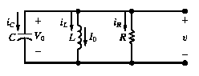
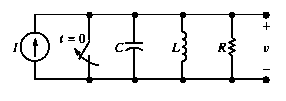
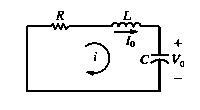
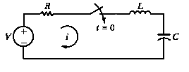

# Análise de Circuitos Elétricos
## Aula 07 - Respostas natural e a um degrau em circuitos de segunda ordem (RLC)
 
Prof. M.Sc. Diego Ascânio Santos (ascanio@cefetmg.br)

Aula baseada sobre o material do professor Dr. Emerson Gonçalves de Melo (emerdemelo@usp.br - DEMAR EEL USP), da professora Drª. Thabatta Moreira Alves de Araújo (thabatta@cefetmg.br - DIGDDV) e da Khan Academy.

CEFET-MG DIGDDV - Divinópolis, 2023.

---

## Roteiro

1. Introdução à resposta natural de um circuito RLC em paralelo.
2. Formas de resposta natural de um circuito RLC em paralelo.
3. Resposta a um degrau de um circuito RLC em paralelo.
4. Respostas natural e a um degrau de um circuito RLC em série.

---

## Objetivos

1. Saber determinar a resposta natural e a resposta a um degrau de circuitos RLC em paralelo.
2. Saber determinar a resposta natural e a resposta a um degrau de circuitos RLC em série.

---

## Introdução - Circuitos de Segunda Ordem

Circuitos de segunda ordem são denominados dessa forma devido à presença de dois elementos que armazenam energia (em diversas configurações), cujas tensões e correntes são regidas por equações diferenciais de segunda ordem.

Em outras palavras, a dinâmica de circuitos de segunda ordem é descrita por equações diferenciais que envolvem a segunda derivada temporal de grandezas como tensão e corrente, refletindo como a energia é trocada entre campos elétricos e magnéticos nos capacitores e indutores presentes no circuito.

Estamos interessados em encontrar as EDOs de ordem 2 que descrevem a resposta destes circuitos ao estímulo natural e ao estímulo degrau, considerando sempre as configurações mistas dos elementos armazenadores de energia — circuitos RLC — compostos por resistores, capacitores e indutores.

---

## Introdução

- Nesta aula, a discussão da resposta natural e ao degrau está limitada a duas configurações: o circuito RLC em paralelo e o circuito RLC em série.

A resposta natural de um circuito RLC em paralelo consiste em determinar a tensão criada nos ramos em paralelo pelo fornecimento de energia armazenada no indutor ou no capacitor ou em ambos, como na figura 1.

<figure>

<!-- _class: transparent -->

<figcaption class="center tiny">

Figura 1: Circuito que ilustra a resposta natural de um circuito \\(RLC\\) paralelo.

</figcaption>

</figure>

Ao aplicar repentinamente uma fonte de corrente contínua (estímulo degrau) em um circuito \\(RLC\\) em paralelo, busca-se entender a tensão nos ramos paralelos, considerando a energia inicial no circuito em \\(t_{0}\\). A representação desse processo é mostrada na figura 2.

<figure>

<!-- _class: transparent -->

<figcaption class="center tiny">

Figura 2: Circuito que ilustra a resposta ao degrau de um circuito \\(RLC\\) paralelo.

</figcaption>

</figure>

A resposta natural de um circuito RLC em série consiste em determinar a corrente gerada nos elementos em série pela descarga (fornecimento) da energia armazenada no indutor, no capacitor ou em ambos, como na figura 3.

<figure>

<!-- _class: transparent -->

<figcaption class="center tiny">

Figura 3: Circuito que ilustra a resposta natural de um circuito \\(RLC\\) série.

</figcaption>

</figure>

Ao aplicar repentinamente uma fonte de tensão contínua (estímulo degrau) em um circuito \\(RLC\\) em série, busca-se entender o comportamento da corrente do sistema — em todos os elementos do circuito, que estão em série — considerando a energia inicial do circuito em \\(t_{0}\\). A representação desse processo é mostrada na figura 4.

<figure>

<!-- _class: transparent -->

<figcaption class="center tiny">

Figura 4: Circuito que ilustra a resposta ao degrau de um circuito \\(RLC\\) paralelo.

</figcaption>

</figure>

---

## Resposta Natural do Circuito RLC Paralelo

- Na resposta natural, estamos interessados na tensão \\(v(t)\\) do circuito. Como todos os elementos estão em paralelo \\(C, L \text{ e } R\\) sabemos que eles possuem a mesma tensão, portanto, \\(v(t)\\) nossa grandeza de interesse é partilhada por eles.

- Entretanto, \\(v(t)\\) ainda é desconhecida e por sabermos que o circuito \\(RLC\\) é um circuito de segunda ordem, devemos de alguma forma encontrar expressões que possuam derivadas de \\(v(t)\\) até a segunda ordem.

- Pela lei de Ohm, bem como, pelas equações de capacitância e indutância (vistas na [aula cinco](https://diegoascanio.github.io/ace-aula-05)), podemos escrever as correntes de cada um destes elementos em função de \\(v(t)\\), nossa grandeza de interesse e até então, desconhecida.

<!-- _class: transparent -->

Em função de \\(v(t)\\):

\\[
\begin{align}
    I_{C}(t) &= C \frac{dv(t)}{dt} \\\\
    I_{R}(t) &= \frac{v(t)}{R} \\\\
    I_{L}(t) &= \frac{1}{L} \int v(t) dt + I_{L}(0)
\end{align}
\\]

Pela Lei de Kirchoff das correntes nos nós:

\\[
\begin{align}
    &I_{C}(t) + I_{R}(t) + I_{L}(t) = 0 \therefore \\\\
    &C \frac{dv(t)}{dt} + \frac{v(t)}{R} + \frac{1}{L} \int v(t) dt + I_{L}(0) = 0
\end{align}
\\]

Podemos derivar os dois lados da equação à esquerda em relação ao tempo \\(t\\):

\\[
\begin{align}
    \frac{d}{dt} &\left( C \frac{dv(t)}{dt} + \frac{v(t)}{R} \right. \\\\ 
    &\left. + \frac{1}{L} \int v(t) dt + I_{L}(0) \right) = 0 \therefore \\\\
    &C \frac{d^{2}v(t)}{dt^{2}} + \frac{1}{R} \frac{dv(t)}{dt} + \frac{1}{L} v(t) = 0
\end{align}
\\]

\\(I_{L}(0)\\) é constante, portanto, \\(\frac{d}{dt} I_{L}(0) = 0\\).

Já encontramos a derivada de segunda ordem de \\(v(t)\\), como esperávamos, agora, multiplicamos a equação por \\(1 \over C\\) e obtemos:

\\[
\begin{align}
    &\frac{d^{2}v(t)}{dt^{2}} + \frac{1}{RC} \frac{dv(t)}{dt} + \frac{1}{LC} v(t) = 0
\end{align}
\\]

Sendo necessário agora encontrar uma função \\(v(t)\\) que satisfaça a equação diferencial acima.

---

## Resposta Natural do Circuito RLC Paralelo - Solução Geral da Equação Diferencial de Segunda Ordem

Recapitulando nossa EDO de ordem 2, temos:

\\[
\begin{align}
    &\frac{d^{2}v(t)}{dt^{2}} + \frac{1}{RC} \frac{dv(t)}{dt} + \frac{1}{LC} v(t) = 0 \tag{1} \label{eq:edo_{2}}\\
\end{align}
\\]

Pela nossa EDO ser de segunda ordem, não podemos solucioná-la pelo método da separação de variáveis para EDOs homogêneas de ordem 1. Mas, sabemos que toda EDO tem por solução uma função exponencial em função de \\(t\\). Consideremos \\(v(t)\\) como

\\[
    v(t) = A e^{st}
\\]

É \\(A e^{st}\\) uma função candidata para solucionar nossa EDO representada pela equação 1? Para descobrirmos, vamos substituir \\(v(t)\\) na equação 1 por \\(A e^{st}\\):

<!-- _class: center -->
### Substituindo \\(v(t)\\) por \\(A e^{st}\\) na equação 1

\\[
\begin{align}
    &\frac{d^{2}(A e^{st})}{dt^{2}} + \frac{1}{RC} \frac{d(A e^{st})}{dt} + \frac{1}{LC} (A e^{st}) = 0 \therefore \\\\
    &A s^{2} e^{st} + \frac{1}{RC} A s e^{st} + \frac{1}{LC} A e^{st} = 0 \therefore \\\\
    &A e^{st} \left( s^{2} + \frac{s}{RC} + \frac{1}{LC} \right) = 0 \tag{2} \label{edo:caract} \\
\end{align}
\\]

Estudando a equação 2, 

\\[A e^{st} \left( s^{2} + \frac{s}{RC} + \frac{1}{LC} \right) = 0 \leftrightarrow A = 0 \text{ ou } {s^2 + \frac{s}{RC} + \frac{1}{LC} = 0} \\]

Pois, \\(e^{st} \neq 0 \text{ } \forall t\\). Se \\(A\\) for nulo, isso implica que \\(v(t) = 0 \text{ } \forall t\\) o que é fisicamente impossível na ocasião em que exista energia armazenada nos elementos do circuito em seu estado inicial, implicando assim que \\(A\\) seja não nulo para generalizar! Logo, \\(A e^{st}\\) é solução candidata para a solução da EDO de ordem 2 quando \\(s^2 + \frac{s}{RC} + \frac{1}{LC} = 0\\). 

O termo \\(s^2 + \frac{s}{RC} + \frac{1}{LC}\\) é chamado de **equação característica** da EDO de ordem 2 e suas raízes \\(s_{1}\\) e \\(s_{2}\\), chamadas de **raízes características** da EDO de ordem 2, fazem com que seja possível encontrar soluções da forma \\(v(t) = A e^{s_{1}t}\\) e \\(v(t) = B e^{s_{2}t}\\) para a EDO de ordem 2.

---

## Resposta Natural do Circuito RLC Paralelo - Solução Geral da Equação Diferencial de Segunda Ordem

A equação \\(s^2 + \frac{s}{RC} + \frac{1}{LC} = 0\\) é chamada de **equação característica** da EDO de ordem 2 porquê suas raízes \\(s_{1}\\) e \\(s_{2}\\) determinam o caráter matemático de \\(v(t)\\).

Para encontrar suas raízes, apenas resolvemos esta equação de segundo grau pela fórmula de Bhaskara:

\\[s_{1,2} = \frac{-\frac{1}{RC} \pm \sqrt{\left(\frac{1}{RC}\right)^2 - 4\frac{1}{LC}}}{2}\\]

Aplicando as manipulações algébricas adequdas temos que:

\\[
\begin{align}
    s_{1} &= -\frac{1}{2RC} + \sqrt{\left(\frac{1}{2RC}\right)^2 - \frac{1}{LC}} \\\\
    s_{2} &= -\frac{1}{2RC} - \sqrt{\left(\frac{1}{2RC}\right)^2 - \frac{1}{LC}}
\end{align}
\\]

Se substituirmos \\(s\\) por \\(s_{1}\\) ou \\(s_{2}\\) na equação \\(v(t) = Ae^{st}\\), a solução satisfaz a EDO descrita pela equação [1](#7), pois, para qualquer valor de \\(A\\), \\(s^{2} + \frac{s}{RC} + \frac{1}{LC} = 0\\) quando \\(s = s_{1}\\) ou \\(s = s_{2}\\), já que \\(s_{1}, s_{2}\\) são raízes da equação característica.

Considere agora \\(v_{1}(t) = A_{1}e^{s_{1}t}\\) e \\(v_{2}(t) = A_{2}e^{s_{2}t}\\) como soluções da EDO [1](#7). A soma \\(v(t) = v_{1}(t) + v_{2}(t)\\) também é solução da EDO (demonstração presente no livro do Riedel 8ª edição).

Destarte, a solução geral da resposta natural do circuito \\(RLC\\) quando \\(s_{1} \neq s_{2} \\) é dada por:

\\[
    V(t) = A_{1}e^{s_{1}t} + A_{2}e^{s_{2}t}
\\]

---

## Resposta Natural do Circuito RLC Paralelo - Solução Geral da Equação Diferencial de Segunda Ordem

É conveniente escrever \\(s_{1} e s_{2}\\) em função dos parâmetros \\(\alpha \text{ e } \omega_{0}\\) para interpretar o comportamento do circuito em relação a seus parâmetros \\(RLC\\) e de suas características — superamortecimento, subamortecimento e amortecimento crítico — que serão estudadas adiante. 

Considerando \\(\alpha = \frac{1}{2RC}\\) e \\(\omega_{0} = \frac{1}{\sqrt{LC}}\\), temos:

\\[
\begin{align}
    s_{1} &= -\alpha + \sqrt{\alpha^{2} - \omega_{0}^{2}} \\\\
    s_{2} &= -\alpha - \sqrt{\alpha^{2} - \omega_{0}^{2}} 
\end{align}
\\]

Os parâmetros \\(\alpha \text{ e } \omega_{0}\\) são conhecidos respectivamente por frequência de néper (ou fator de amortecimento) e frequência angular de ressonância (ou fator de oscilação) e eles que ditarão as características do circuito (superamortecimento, subamortecimento e amortecimento crítico).

A tabela abaixo apresenta um resumo destes parâmetros para facilitar o entendimento:

<!-- _class: ttable -->
|      Parâmetro     |              Terminologia             |                      Valor (na resposta natural)                    |      Unidade      |
|:------------------:|:-------------------------------------:|:-------------------------------------------------------------------:|:-----------------:|
| \\(s_{1}, s_{2}\\) |    Raízes da equação característica   | \\(s_{1}, s_{2} = -\alpha \pm \sqrt{\alpha^{2} - \omega_{0}^{2}}\\) |\\(\frac{rad}{s}\\)|
|  \\(\alpha\\)      |          Frequência de néper          |                \\( \alpha = \frac{1}{2RC} \\)                       |\\(\frac{rad}{s}\\)|
| \\(\omega_{0}\\)   |   Frequência angular de ressonância   |           \\( \omega_{0} = \frac{1}{\sqrt{LC}} \\)                  |\\(\frac{rad}{s}\\)|

Porque as unidades de todos os parâmetros estão em \\(\frac{rad}{s}\\)? Porque as raízes \\(s_{1}\\) e \\(s_{2}\\) (e por consequência, os parâmetros \\(\alpha \text{ e } \omega_{0}\\) que as determinam) são coeficientes do tempo \\(t\\) na exponencial \\(e^{st}\\). Como o expoente de \\(e\\) deve ser adimensional, logo, \\(s\\) deve ter a dimensão do recíproco (neste caso, inverso) do tempo — a frequência — para manter o expoente de \\(e^{st}\\) adimensional.

---

## Resposta Natural do Circuito RLC Paralelo - Solução Geral da Equação Diferencial de Segunda Ordem

Como visto no slide anterior, \\(\alpha\\) (frequência de néper) e \\(\omega_{0}\\) (frequência natural) ditam a natureza das raízes \\(s_{1}\\) e \\(s_{2}\\) e, por consequência, o comportamento do circuito na resposta ao estímulo natural.

Quando \\({\omega_{0}}^{2} < {\alpha}^{2}\\), as raízes \\(s_{1}, s_{2}\\) são reais e distintas, e a resposta natural é do tipo **superamortecida**.

Quando \\({\omega_{0}}^{2} = {\alpha}^{2}\\), as raízes são reais e iguais, e a resposta natural é do tipo **criticamente amortecida**. 

Quando \\({\omega_{0}}^{2} > {\alpha}^{2}\\), as raízes são complexas conjugadas, e a resposta natural é do tipo **subamortecida**.

Veremos mais adiante as características de cada uma destas respostas. Por hora, vamos aprender como determinar as raízes da equação característica de um circuito \\(RLC\\) paralelo através do exemplo 8.1 (pág. 296) do livro do NILSSON, RIEDEL - 10ª edição.

---

## Determinação das raízes da equação característica de um circuito RLC paralelo

<iframe src="https://diegoascanio.github.io/jupyterlite/lab?path=exemplo_8.1.ipynb" width=100% height=100%></iframe> 

---

## Características das Respostas Naturais dos Sistemas de Segunda Ordem

Já vimos que existem três tipos de respostas naturais para sistemas de segunda ordem, que são: superamortecida, criticamente amortecida e subamortecida, mas, não aprendemos ainda a distinguí-las. Nos próximos slides, começando da ordem reversa, vamos aprender como se comportam a partir de uma aplicação que pode ser modelada por um sistema de segunda ordem: portas mecânicas de fechamento automático (sistema massa-mola-amortecedor).

---

## Características das Respostas Naturais dos Sistemas de Segunda Ordem

**Resposta subamortecida (oscila em torno do ponto de equilíbrio)**

<!-- _class: center -->

- O sistema não tem amortecimento suficiente para prevenir oscilações, mas, tem algum amortecimento que faz com que as oscilações decaiam ao longo do tempo.
- As raízes \\(s_{1}, s_{2}\\) do polinômio característico são distintas, imaginárias (complexas), mas, conjugadas.

---

## Características das Respostas Naturais dos Sistemas de Segunda Ordem

**Resposta criticamente amortecida (não oscila em torno do ponto de equilíbrio e alcança este ponto rapidamente)**

- O sistema tem amortecimento crítico — **AMORTECIMENTO MÍNIMO O SUFICIENTE** — para prevenir oscilações — por isso, dizemos que é criticamente amortecido — e por não ter amortecimento maior do que o necessário, o sistema atinge o ponto de equilíbrio (seu estado estacionário) o mais rápido possível.
- As raízes \\(s_{1}, s_{2}\\) do polinômio característico são iguais e reais.

---

## Características das Respostas Naturais dos Sistemas de Segunda Ordem

**Resposta superamortecida (não oscila em torno do ponto de equilíbrio e alcança este ponto lentamente)**

- O sistema tem superamortecimento — **AMORTECIMENTO MAIOR DO QUE O SUFICIENTE PARA PREVENIR OSCILAÇÕES** — por isso, dizemos que é superamortecido — e por ter amortecimento maior do que o necessário, o sistema atinge o ponto de equilíbrio (seu estado estacionário) de forma lenta.
- As raízes \\(s_{1}, s_{2}\\) do polinômio característico são distintas e reais.

**Agora, a primeira ordem apresentada das respostas é retomada, sendo discutidas (a seguir) as respostas naturais — superamortecida, criticamente amortecida e subamortecida — do circuito RLC**

<video style="display: block; margin: auto;" width="240" controls src="./videos/superamortecido.mp4" type="video/mp4"></video>

---

## Formas de resposta natural de um circuito \\(RLC\\) paralelo

Pela superposição, sabemos que a tensão de um circuito \\(RLC\\) paralelo em resposta ao estímulo natural tem a forma:

\\[
    v = A_{1} e^{s_{1} t} + A_{2} e^{s_{2} t}
\\]

Para encontrar as soluções para a resposta natural (como também para o degrau ) é necessário encontrar os valores de \\(A_{1}\\) e \\(A_{2}\\).

Como estamos lidando com equações diferenciais ordinárias da segunda ordem, só conseguiremos obter os valores de \\(A_{1}, A_{2}\\) na resposta ao estímulo natural se conhecermos as condições iniciais do circuito (tensão e / ou corrente no instante \\(t = t_{0}\\)), bem como, as derivadas de primeira ordem da tensão e / ou corrente no mesmo instante.

Para a resposta de um circuito \\(RLC\\) ao estímulo degrau, como verificado adiante, são necessários os valores finais das grandezas de interesse \\((V_{f} \text{ e / ou } I_{f})\\).

Para cada tipo de resposta existente — **superamortecida, criticamente amortecida e subamortecida** — existe uma forma de determinar os valores de \\(A_{1}\\) e \\(A_{2}\\) e, consequentemente, determinar a função da resposta natural do circuito.

---

## Formas de resposta natural de um circuito \\(RLC\\) paralelo — Resposta Superamortecida

- Recapitulando: ocorre quando as raízes da equação característica são reais e distintas.

- A solução para \\(v(t)\\) tem a forma

\\[
    v(t) = A_{1} e^{s_{1} t} + A_{2} e^{s_{2} t}
\\]

- Para determinar as constantes \\(A_{1}\\) e \\(A_{2}\\), precisamos das condições iniciais do circuito, dadas pelos valores de \\(v(0^{+})\\) e \\(\frac{dv(0^{+})}{dt}\\) que por sua vez, são determinados pela tensão inicial no capacitor, \\(V_{0}\\), e pela corrente inicial no indutor, \\(I_{0}\\).

Considerando \\(v(0^{+})\\), temos:

\\[
    v(0^{+}) = A_{1} e^{s_{1} \times 0} + A_{2} e^{s_{2} \times 0} = A_{1} + A_{2}
\\]

Ao fazermos a primeira derivada, temos:

\\[
    \frac{dv(t)}{dt} = A_{1} s_{1} e^{s_{1} t} + A_{2} s_{2} e^{s_{2} t}
\\]

Substituindo \\(t = 0^{+}\\), temos:

\\[
\begin{align}
    \frac{dv(0^{+})}{dt} &= A_{1} s_{1} e^{s_{1} \times 0} + A_{2} s_{2} e^{s_{2} \times 0} \therefore \\\\
    \frac{dv(0^{+})}{dt} &= s_{1} A_{1} + s_{2} A_{2}
\end{align}
\\]

Se conhecermos \\(s_{1}\\) e \\(s_{2}\\), encontrar \\(A_{1}\\) e \\(A_{2}\\) limita-se a:
1. Determinar \\(v(0^{+})\\) e \\(\frac{dv(0^{+})}{dt}\\);
2. Resolver o sistema linear resultante.

---

## Formas de resposta natural de um circuito \\(RLC\\) paralelo — Resposta Superamortecida

Se conhecermos \\(s_{1}\\) e \\(s_{2}\\), encontrar \\(A_{1}\\) e \\(A_{2}\\) limita-se a:
1. Determinar \\(v(0^{+})\\) e \\(\frac{dv(0^{+})}{dt}\\);
2. Resolver o sistema linear resultante.

<!-- _class: transparent center -->

- O valor \\(v_{0^{+}}\\) é a tensão \\(V_{0}\\) no capacitor no instante \\(t=0^{+}\\);
- Pelas equações da capacitância:

\\[
\begin{align}
    i_{C}(0^{+}) &= C \frac{dv_{0^{+}}}{dt} \therefore \\\\
    \frac{dv_{0^{+}}}{dt} &= \frac{i_{C}(0^{+})}{C} \tag{3}
\end{align}
\\]

- Assim, temos que determinar qual a corrente \\(i_{C}(0^{+})\\) que circula no capacitor no instante \\(t=0^{+}\\);
- Pela Lei de Kirchoff das Correntes nos nós, temos que \\(0 = i_{C} + i_{L} + i_{R} \\);
- Pela Lei de Ohm, temos que \\(i_{R} = \frac{V_{0}}{R}\\);
- A corrente presente no indutor no instante de tempo \\(t=0^{+}\\) é \\(I_{0}\\);

- Reorganizando a equação obtida pela LKC nos nós obtém-se: \\(i_{C} = -i_{R} - i_{L}\\);
- Substituindo-se \\(I_{R}\\) por \\(\frac{V_{0}}{R}\\) e \\(I_{L}\\) por \\(I_{0}\\), temos que \\(i_{C} = -\frac{V_{0}}{R} - I_{0}\\);
- Assim, podemos determinar o valor numérico de \\(i_{C}(0^{+})\\) e substituir na equação (3) para determinar \\(\frac{dv_{0^{+}}}{dt}\\).
- Depois, substituimos \\(v_{0^{+}}\\) e \\(\frac{dv_{0^{+}}}{dt}\\) no sistema linear e o resolvemos, obtendo \\(A_{1}\\) e \\(A_{2}\\).

---

## Formas de resposta natural de um circuito \\(RLC\\) paralelo — Resposta Superamortecida

O processo para determinação da resposta superamortecida \\(v(t)\\) pode ser resumido da seguinte forma — ipsis líteris ao contido em NILSSON, RIEDEL 10ª Edição p. 298:

1. Determine as raízes da equação característica \\(s_{1}\\) e \\(s_{2}\\), usando os valores de \\(R, L \text{ e } C\\);
2. Determine \\(v(0^{+})\\) e \\(\frac{dv(0^{+})}{dt}\\) usando análise de circuitos;
3. Determine os valores de \\(A_{1}\\) e \\(A_{2}\\) usando as equações simultaneamente:
\\[
\begin{align}
v(0^{+}) &= A_{1} + A_{2} \\\\
\frac{dv(0^{+})}{dt} &= \frac{i_{C}(0^{+})}{C} = s_{1}A_{1} + s_{2}A_{2}
\end{align}
\\]
4. Substitua os valores de \\(s_{1}, s_{2}, A_{1} \text{ e } A_{2}\\) na equação da resposta natural \\(v(t) = A_{1}e^{s_{1}t} + A_{2}e^{s_{2}t}\\) para determinar \\(v(t), t \geq 0\\).

Resolveremos dois exemplos (8.2, 8.3) presentes no livro de NILSSON, RIEDEL 10ª Edição p. 298-300 para ilustrar o processo de determinação da resposta superamortecida.

---

## Resposta Natural Superamortecida RLC — Exemplo 8.2

<iframe src="https://diegoascanio.github.io/jupyterlite/lab?path=exemplo_8.2.ipynb" width=100% height=100%></iframe> 

---

## Cálculo das correntes de ramo na resposta natural de um circuito RLC em paralelo — Exemplo 8.3

<iframe src="https://diegoascanio.github.io/jupyterlite/lab?path=exemplo_8.3.ipynb" width=100% height=100%></iframe> 
