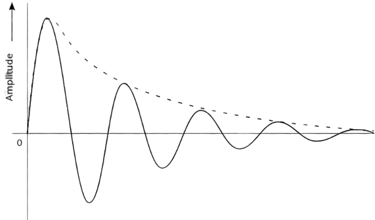

# Seminário - Análise de Circuitos Elétricos
# Grupo 1  - As características da resposta subamortecida natural
 
Gabriel Teixeira Júlio (gabriel.julio@aluno.cefetmg.br), Marcus Vinicius Nogueira Santos (marcuscefet@gmail.com), Mateus Henrique Pereira (mateus@aluno.cefetmg.br) e Pablo Sousa da Silva (pablossilva.005@gmail.com)

Aula baseada sobre o material do professor Dr. Emerson Gonçalves de Melo (emerdemelo@usp.br - DEMAR EEL USP), da professora Drª. Thabatta Moreira Alves de Araújo (thabatta@cefetmg.br - DIGDDV), do professor M.Sc. Diego Ascânio Santos (ascanio@cefetmg.br) e da Khan Academy.

CEFET-MG DIGDDV - Divinópolis, 2023.

---

## Roteiro

1. Respota natural de um circuito RLC em paralelo subamortecido.
2. Características da resposta subamortecida natural.

---

## Objetivos

1. Saber a resposta natural de circuitos RLC em paralelo subaortecido.
2. Saber as características da resposta subamortecida natural.

---

## Resposta Natural Subamortecida do circuito RLC paralelo

<!-- _class: transparent -->

Quando consideramos a resposta subamortecida de um circuito RLC, admitimos que as raízes do polinômio característico que descreve o circuito são complexas e conjugadas. Para que este caso aconteça, o discriminante da equação característica deve ser menor que zero — **ou seja, \\( \alpha^{2} - \omega_{0}^{2} < 0 \rightarrow \alpha^{2} < \omega_{0}^{2} \\)** — o que implica a existência de uma raiz quadrada de um número negativo, onde esse número pode ser escrito da forma:

Consideremos \\(s_{1}, s_{2} = -\alpha \pm \sqrt{\alpha^{2} - \omega_{0}^{2}} = -\alpha \pm j\omega_{d}\\).

É possível reescrever \\(s_{1}\\) (e \\(s_{2}\\)), por conveniência da expressão, como:

\\[
\begin{align}
    s_{1} &= -\alpha + j \omega_{d} \\\\
    s_{2} &= -\alpha - j \omega_{d}
\end{align}
\\]

Onde \\(\omega_{d}\\) é a frequência angular amortecida do circuito definida como:

\\[
    \omega_{d} = \sqrt{{\omega_{0}}^{2} - \alpha^{2}}
\\]

Considerando que nossas raízes \\(s_{1}\\) e \\(s_{2}\\) são complexas e conjugadas, podemos escrever a resposta natural subamortecida do circuito RLC paralelo pela forma padrao da resposta natural como:

\\[
    v(t) = A_{1} e^{(-\alpha + j \omega_{d})t} + A_{2} e^{(-\alpha - j \omega_{d})t}
\\]

Aplicanco manipulações algébricas necessárias podemos escrever a resposta subamortecida como uma soma de senos e cossenos que oculta o termo \\(j\\) (complexo) da resposta final.

\\[
\begin{align}
    v(t) &= B_{1} e^{-\alpha t} \cdot \cos(\omega_{d} t) + B_{2} e^{-\alpha t} \cdot \sin(\omega_{d} t)
\end{align}
\\]

**A forma padrão da resposta natural subamortecida.**

---

## Características da resposta subamortecida natural

A resposta subamortecida em circuitos RLC é caracterizada por oscilações que diminuem gradualmente ao longo do tempo. Ela ocorre quando a resistência no circuito é relativamente baixa, resultando em um fator de amortecimento menor que 1. Algumas características importantes da resposta subamortecida natural em circuitos RLC:

1. **Oscilações Sobrepostas:** A resposta subamortecida resulta em oscilações que sobrepujam a resposta transitória e persistem por algum tempo antes de eventualmente atenuarem. Essas oscilações são caracterizadas por picos e vales.

2. **Frequência Natural (\\(\omega_{0}\\)):** A frequência natural do sistema é a frequência das oscilações não amortecidas. É determinada pelos valores dos componentes no circuito (resistor, indutor e capacitor) e é dada por \\(\omega_{0} = \frac{1}{\sqrt{LC}}\\) , onde L é a indutância e C é a capacitância.

<!-- _class: transparent -->

---

## Características da resposta subamortecida natural

3. **Fator de Amortecimento (\\(\zeta\\)):** O fator de amortecimento é uma medida da quantidade de amortecimento presente no sistema. Para a resposta subamortecida, o fator de amortecimento é  \\(0 < \zeta < 1\\). É determinada pelos valores dos componentes no circuito (resistor, indutor e capacitor) e é dado por \\(\zeta = \frac{R}{2L\omega_{0}}\\), onde R é a resistência e L é a indutância.

4. **Tempo de Subida (\\(T_{r}\\)):** O tempo de subida é o tempo necessário para a resposta atingir aproximadamente 63,2% do valor final após uma mudança no sinal de entrada. Para sistemas subamortecidos, o tempo de subida é menor em comparação com sistemas superamortecidos. É determinado por \\(T_{r} = \frac{1}{\zeta\omega_{0}}\\), onde \\(\zeta\\) é o fator de amortecimento e \\(\omega_{0}\\) é a frequência natural.  

<!-- _class: transparent -->

---

## Características da resposta subamortecida natural

5. **Ressonância:** Pode ocorrer ressonância se a frequência da fonte de entrada coincidir com a frequência natural do sistema. Isso pode resultar em picos mais pronunciados na resposta do sistema.

6. **Amplitude Máxima (Overshoot)\\((\\%OS)\\):**  resposta subamortecida geralmente exibe um overshoot, que é a porcentagem pela qual a resposta ultrapassa o valor final antes de se estabilizar. O overshoot é maior em sistemas subamortecidos em comparação com sistemas criticamente amortecidos. É determinado por \\(\\%OS = 100 . e^{-\frac{\zeta\pi}{\sqrt{1-\zeta^2}}}\\), onde \\(\zeta\\) é o fator de amortecimento.

<!-- _class: transparent -->

---

## Características da resposta subamortecida natural

7. **Tempo de Estabilização \\((T_{s})\\):** O tempo de estabilização é o tempo necessário para que a resposta atinja e permaneça dentro de uma faixa aceitável ao redor do valor final. Para sistemas subamortecidos, o tempo de estabilização pode ser maior em comparação com sistemas criticamente amortecidos. Ele pode ser dividido em 3 tipos:

- 4% - Maior oscilação no valor final:

\\[
\begin{align}
T_{s} = \frac{3,2}{\zeta\omega_{0}}
\end{align}
\\]

- 3% - Média oscilação no valor final:

\\[
\begin{align}
T_{s} = \frac{3,5}{\zeta\omega_{0}}
\end{align}
\\]

- 2% - Menor oscilação no valor final:

\\[
\begin{align}
T_{s} = \frac{4}{\zeta\omega_{0}}
\end{align}
\\]

<!-- _class: transparent -->

---

Referências Bibliográficas

- RIEDEL, SUSAN A.; NILSSON, James W. — Circuitos Elétricos 8ª ed. 2009.
- RIEDEL, SUSAN A.; NILSSON, James W. — Circuitos Elétricos 10ª ed. 2015.
- DE MELO, E. G. — Curso: LOM3202 - Circuitos Elétricos (2020). Accessed August 6, 2023. https://edisciplinas.usp.br/course/view.php?id=82680.
- DE ARAÚJO, THABATTA M. A. - SLIDES E NOTAS DE AULAS - Disponível junto à profª Thabatta.

